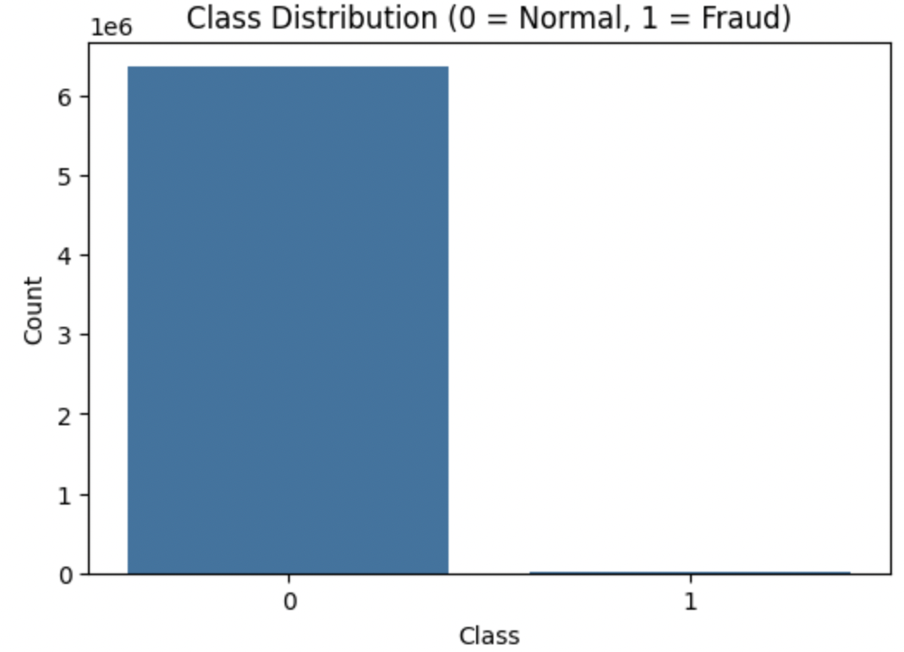
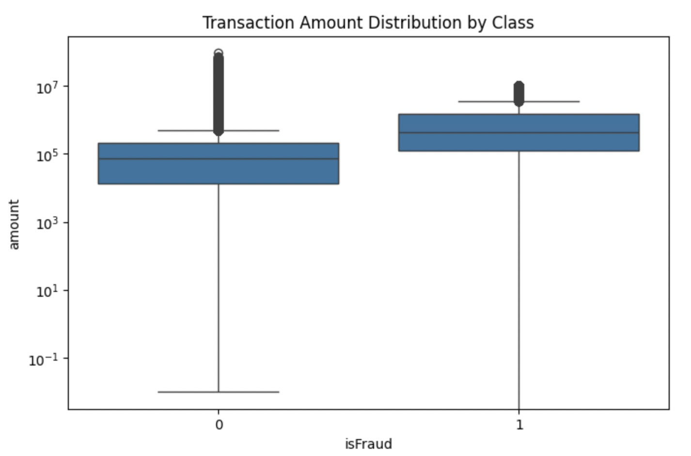
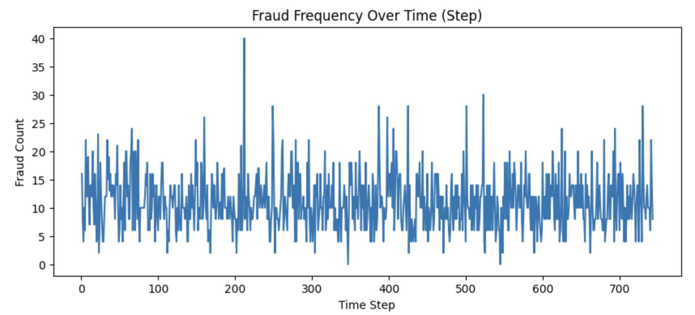
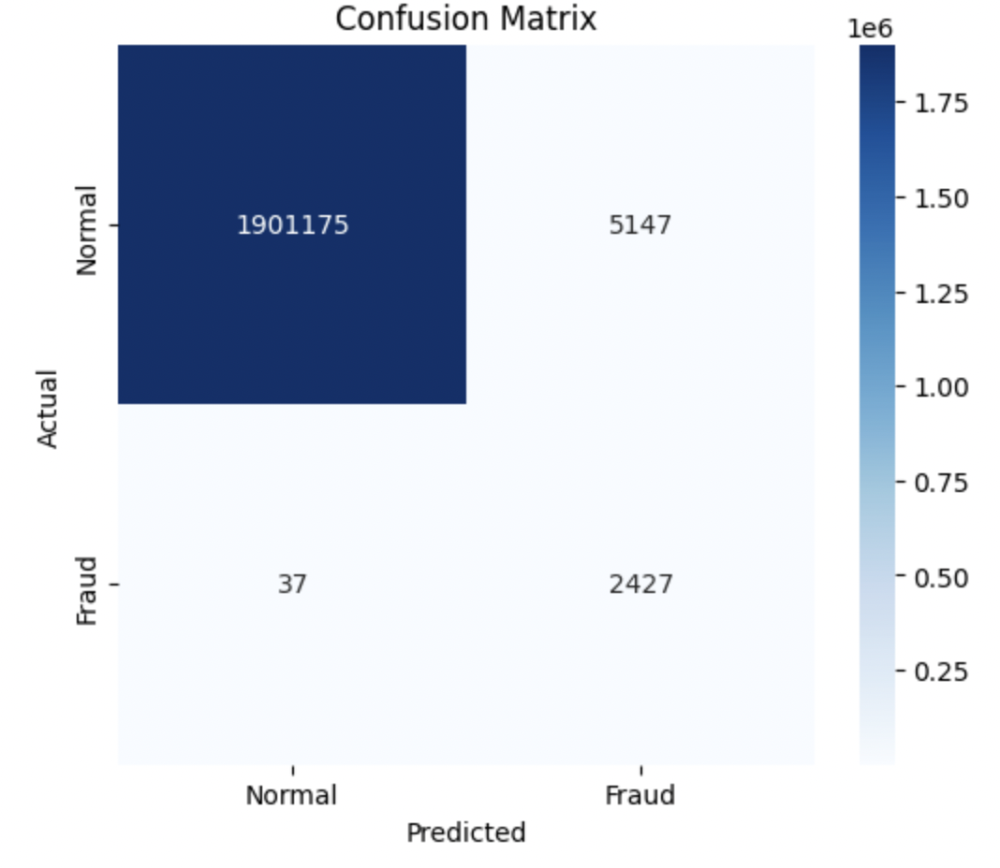
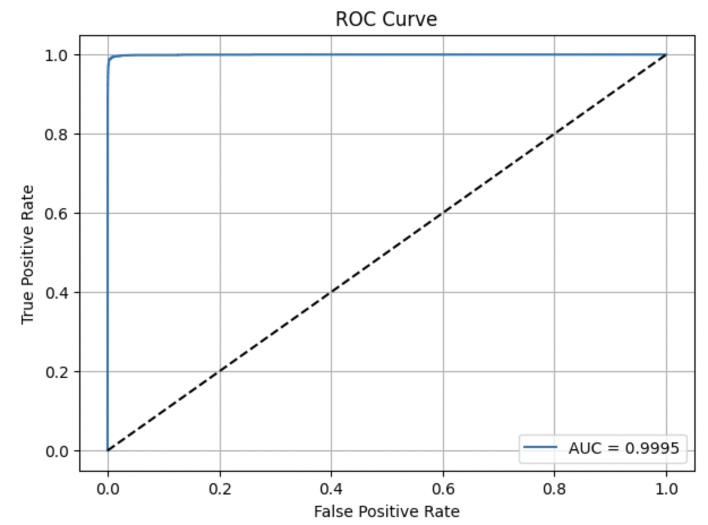
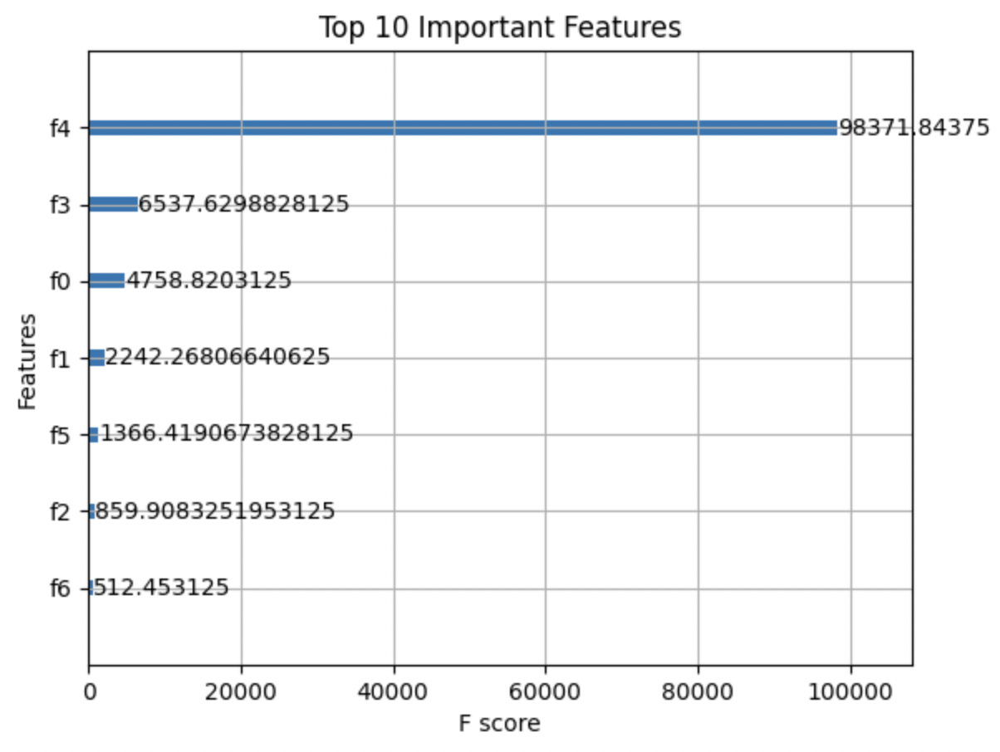

# 💰 Financial Anomaly Detection System (PaySim)

Welcome to a cutting-edge AI project that combines the power of machine learning with real-world financial fraud detection. This project demonstrates how modern supervised learning techniques like **XGBoost** can be used to accurately detect **fraudulent mobile money transactions**, using a publicly available dataset.

---

## 📌 Problem Statement

Fraudulent financial activity is on the rise, particularly in mobile banking and online transactions. Traditional rule-based systems often fail to catch evolving fraud patterns due to:

- Extreme class imbalance (frauds are < 0.2% of all transactions)
- Sophisticated, often stealthy fraud behaviors
- Lack of contextual and behavioral intelligence in legacy systems

This project aims to build a **scalable anomaly detection pipeline** that helps accounting firms automatically flag suspicious transactions **uploaded by clients via their mobile app**, reducing manual review time and increasing trust.

---

## 📊 Dataset

We use the [PaySim Synthetic Financial Dataset](https://www.kaggle.com/datasets/ntnu-testimon/paysim1) — a large-scale simulation of mobile money transactions modeled after real logs.

- **Size**: ~6.3 million transactions
- **Features**: Type, amount, origin/destination balances, fraud flags
- **Fraud Cases**: ~8,000 out of 6.3 million (≈ 0.13%)

---

## 🧠 Solution Approach

We first experimented with **unsupervised anomaly detection** (Isolation Forest), but due to low recall, we switched to a **supervised XGBoost classifier** with custom class weights.

### 💡 Key Techniques:
- Log-scaling of skewed features
- Class balancing via `scale_pos_weight`
- ROC AUC, Precision, Recall, and F1-score evaluation
- XGBoost Feature Importance
- Advanced visualizations to interpret model output

---

## 📈 Visual Insights

Here are the most impactful plots included in this project:

### 📌 1. Class Imbalance  
> Shows how rare fraud is — only 0.13% of the data.

---

### 📌 2. Transaction Amount by Class  
> Fraud transactions often occur at higher or manipulated amounts.

---

### 📌 3. Fraud Frequency Over Time  
> Tracks when frauds occur most frequently across time steps.

---

### 📌 4. Confusion Matrix  
> Shows how many frauds were caught and how many were missed.

---

### 📌 5. ROC Curve  
> Visualizes how well the model separates fraud from normal transactions.

---

### 📌 6. Feature Importance  
> Explains which financial features influenced the model most.

---

## 🚀 Results

| Metric           | Value        |
|------------------|--------------|
| **Accuracy**     | 99.74%       |
| **Recall (Fraud)** | 98.54%     |
| **Precision (Fraud)** | 32.59% |
| **F1 Score (Fraud)** | 48.99%  |
| **ROC AUC Score** | 0.9996      |

✅ This model caught **98.5% of all frauds**, with acceptable trade-offs in precision — making it suitable for use in risk management or second-level human review.

---

## 🛠️ Tech Stack

- **Python**, **Pandas**, **NumPy**
- **XGBoost**
- **Matplotlib**, **Seaborn**
- **scikit-learn**
- *(Optional)*: Streamlit for future dashboard integration

---

## 📁 Project Structure

financial-anomaly-detection-paysim/
│
├── data/ # PaySim dataset
├── notebooks/ # EDA and modeling notebooks
├── src/ # Source code modules (preprocessing, model, evaluation)
├── images/ # Generated plots for README
├── app/ # Optional: Streamlit dashboard
├── requirements.txt
└── README.md

---

## 🧠 Future Enhancements

- Add SHAP Explainability for per-transaction insights
- Deploy as a REST API or Streamlit app
- Incorporate time-based LSTM models for behavioral fraud detection

---

## 👨‍💼 Built For

This project is designed for **accounting and finance professionals to **automate the review of uploaded financial records** using AI.

---

## 📎 License & Attribution

- Dataset: [PaySim by NTNU](https://www.kaggle.com/datasets/ealaxi/paysim1)
- Author: Vivek Veman
